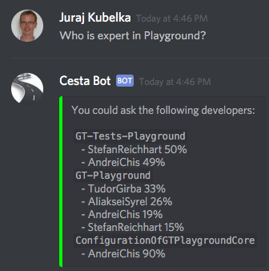

## Bot App Examples

### Display Existing Servers (Guilds)

```Smalltalk
DSBot new
	token: 'BOT-TOKEN';
	servers.
```


### Send Message

```Smalltalk
DSBot new
	token: 'BOT-TOKEN';
	with: [ :bot | bot message
		content: 'Hi! I am a bot :-)';
		sendToServer: 'Pharo' channel: 'general' ].
```


### Expertise

There is an example of a bot, that listen to incoming messages and answer the question *Who is expert in ...?*

```Smalltalk
bot := DSBot new.
bot token: 'BOT-TOKEN'.
bot connect.

answer := DSExpertiseAnswer new bot: bot; yourself.

bot announcer 
	when: DSGatewayMessageAnnouncement 
	do: [ :ann | 
		DSExpertiseQuestion 
			message: ann message
			answer: answer ].
```




For more examples see `DSBot` and `DSClientPostBuilder` classes.
