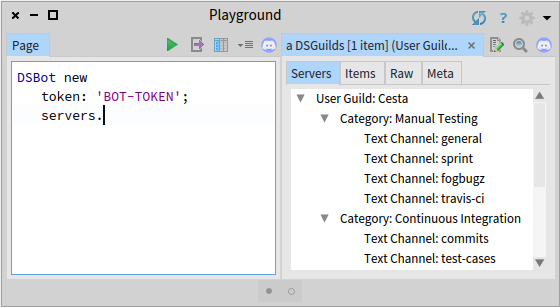
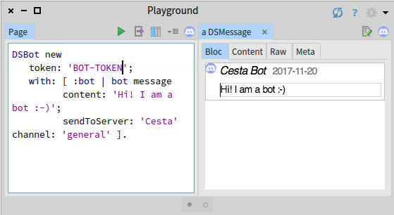

## Bot App Examples

### Display Existing Servers (Guilds)

```Smalltalk
DSBot new
	token: 'BOT-TOKEN';
	servers.
```



### Send Message

```Smalltalk
DSBot new
	token: 'BOT-TOKEN';
	with: [ :bot | bot message
		content: 'Hi! I am a bot :-)';
		sendToServer: 'Pharo' channel: 'general' ].
```



For more examples see `DSBot` and `DSClientPostBuilder` classes.
