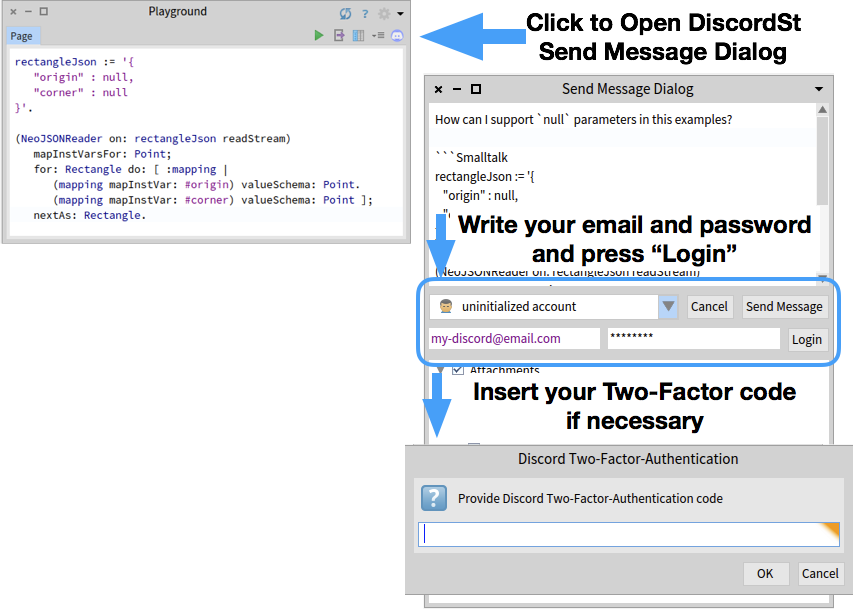
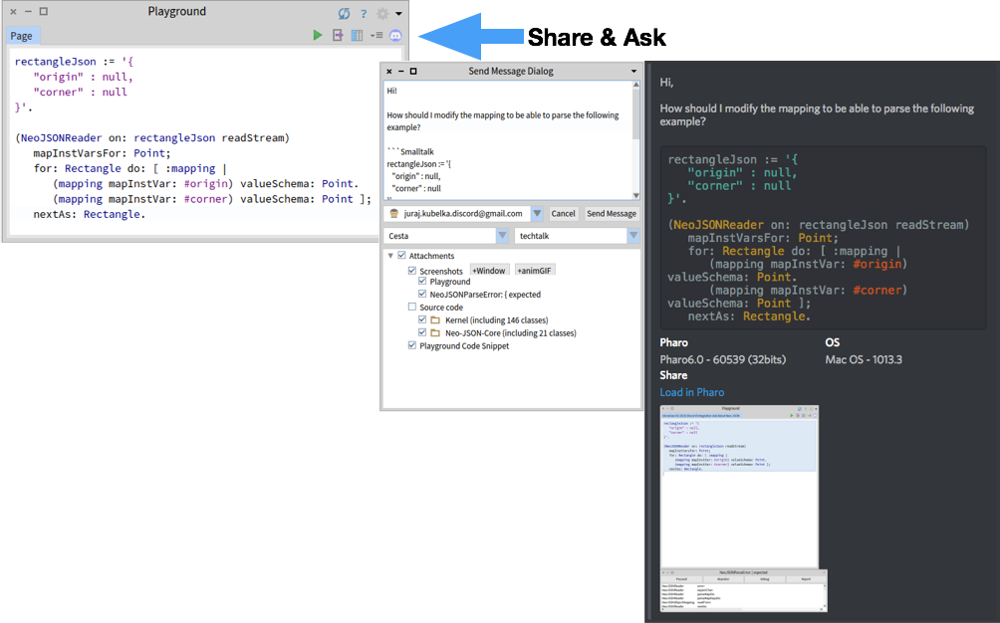
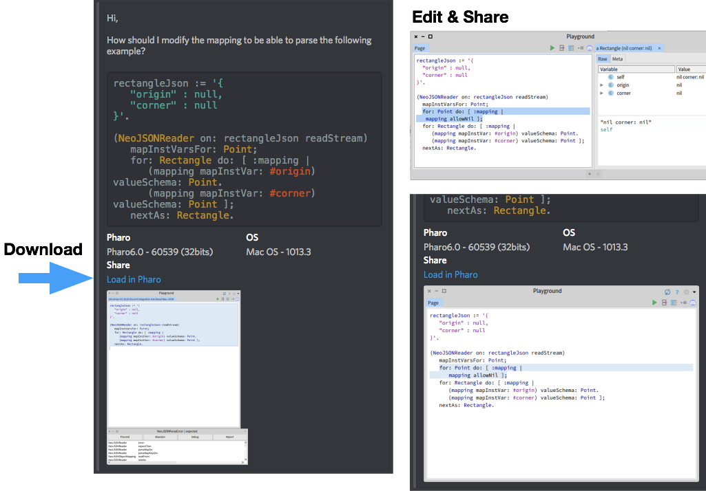
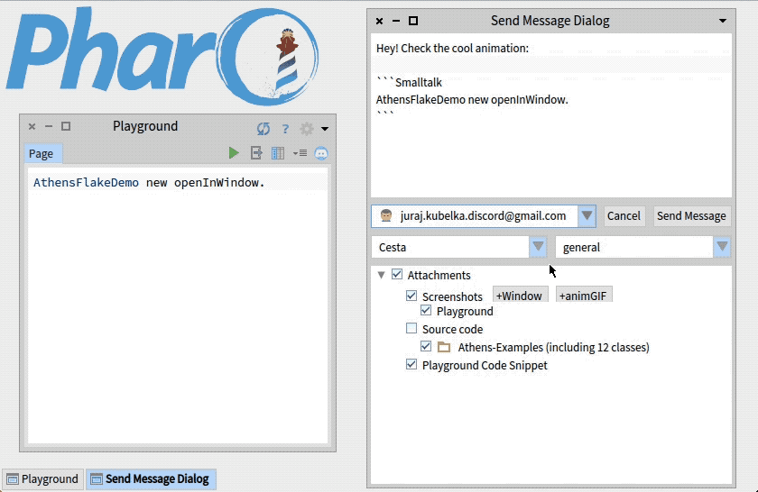
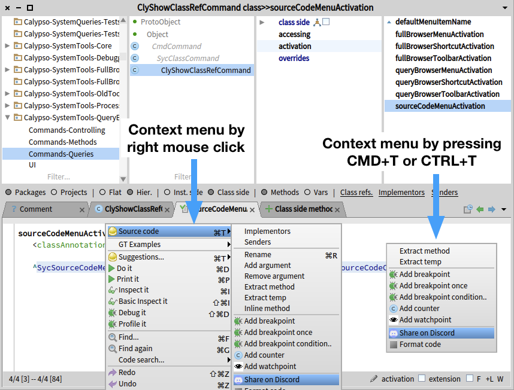
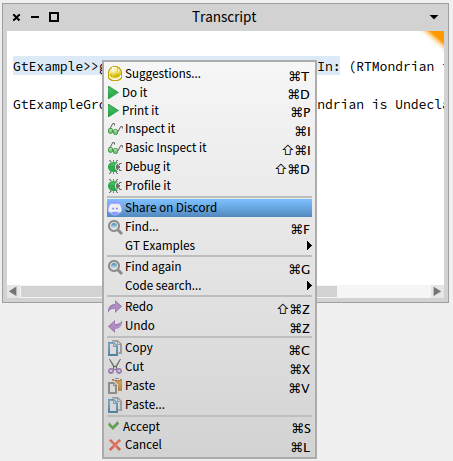
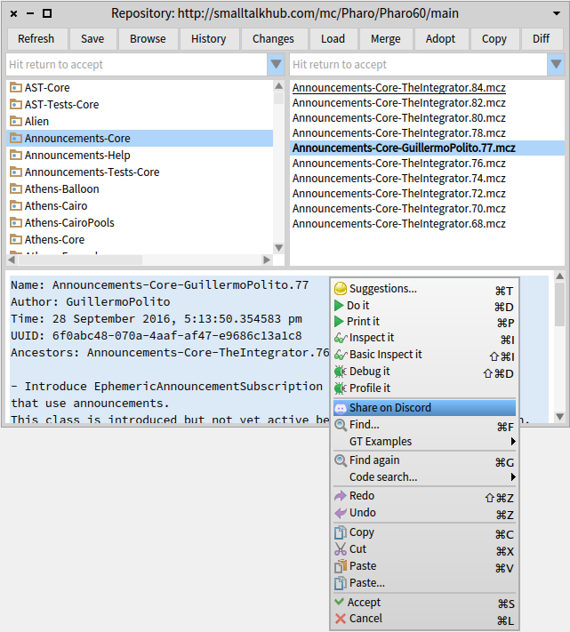

# Pharo Integration

This section describes how the DiscordSt is integrated with developer tools in order to bring better electronic communication experience to Pharo developers. Notice, that the current version is focused on sending messages with a rich contents. 

## Login

The first time you use the DiscordSt integration, you need to login. To do so, open the DiscordSt send message dialog and in the account part, fill-in your Discord account email and password. If you use Two-Factor-Authentication, provide a code when requested.

## Ask Developers from GT-Playground

If you have a code snippet in GT-Playground and you get stuck with it, ask directly from the playground. Click on the Discord icon. In the *Send Message Dialog*, you can write a question and choose a best channel to ask. In addition, you can add screenshots and source code in order to help the readers to understand your problem and play with it.

The figure below shows a code snippet where a developer does not know how to parse a JSON object, representing `Rectangle` that may include `null` values. The developer asks the questions, including the code snippet, and playground and *debugger* window screenshots. A reader thus may understand the issue right from the Discord client by observing the screenshots. In addition, the message includes basic information about Pharo and operating system version.

Notice that you can also add a source code if necessary. Currently, the proposed packages to share are given according to used classes in the shared GT-Playground. If you need to share another package, add write any class of such package to the playground.

## Answer Questions from GT-Playground

If you want to play with a posted code snippet, that may also includes necessary source code to load with, you can click on the *Load in Pharo* link. It redirects you to a web page with a further information. There is a code snippet that you should copy-and-paste to your Pharo image and execute. It will open the shared GT-Playground in your Pharo image. If the shared message also includes a source code to load, it will open Monticello Browser to check the source code. You can then load or merge the shared source code using the standard Monticello facilities.

## Record and Share Animated GIFs

The Pharo integration includes an option to share animated GIFs. You can take the advantage of it to share visual animations, steps to reproduce an error, short tutorials, and other ideas.

## Share Code from System Browser

The Pharo integration includes an option to share a method source code directly from the Calypso system browser. The former system browser, Nautilus, is also supported.

## Share Code from Text Editor and Transcript

Technically, you can share a text (code snippet) from any text editor, including Transcript and the Monticello repository.

