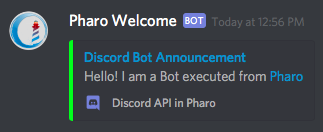
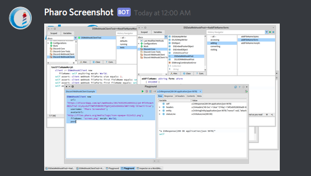

## Webhook Examples

### Text Messages

You can send a simple message by executing:

```Smalltalk
DSWebhookClient new 
	url: 'https://discordapp.com/api/webhooks/WEBHOOK-ID/WEBHOOK-TOKEN';
	message: 'Hello! I am a Bot executed from Pharo';
	post
```

Or you can add username and avatar information by executing:

```Smalltalk
DSWebhookClient new 
	url: 'https://discordapp.com/api/webhooks/WEBHOOK-ID/WEBHOOK-TOKEN';
	message: 'Hello! I am a Bot executed from [Pharo](http://pharo.org)';
	username: 'Pharo Welcome';
	avatarUrl: 'http://files.pharo.org/media/logo/icon-opaque-512x512.png';
	post
```


```Smalltalk
DSWebhookClient new 
	url: 'https://discordapp.com/api/webhooks/WEBHOOK-ID/WEBHOOK-TOKEN';
	username: 'Pharo Welcome';
	avatarUrl: 'http://files.pharo.org/media/logo/icon-opaque-512x512.png';
	embedTitle: 'Discord Bot Announcement';
	embedDescription: 'Hello! I am a Bot executed from [Pharo](http://pharo.org)';
	embedUrl: 'https://github.com/JurajKubelka/DiscordSt';
	embedColor: Color green;
	embedFooterText: 'Discord API in Pharo';
	embedFooterIconUrl: 'https://discordapp.com/assets/2c21aeda16de354ba5334551a883b481.png';
	post
```



### Attachments and Images

You can send a file, for example an image:

```Smalltalk
DSWebhookClient new 
	url: 'https://discordapp.com/api/webhooks/WEBHOOK-ID/WEBHOOK-TOKEN';
	message: 'Pharo loves Discord';
	fileName: 'pharo-logo.png' 
	bytes: (ZnEasy 
		get: 'http://files.pharo.org/media/logo/icon-opaque-512x512.png') contents;
	post.
```

or a screenshot of a Form object:

```Smalltalk
DSWebhookClient new 
	url: 'https://discordapp.com/api/webhooks/WEBHOOK-ID/WEBHOOK-TOKEN';
	message: 'Pharo loves Discord';
	fileName: 'help-icon.png' form: Smalltalk ui icons help;
	post.
```

or a screenshot of a Morph object:

```Smalltalk
DSWebhookClient new 
	url: 'https://discordapp.com/api/webhooks/WEBHOOK-ID/WEBHOOK-TOKEN';
	username: 'Pharo Screenshot';
	avatarUrl: 'http://files.pharo.org/media/logo/icon-opaque-512x512.png';
	fileName: 'screen.png' morph: World;
	post.
```


